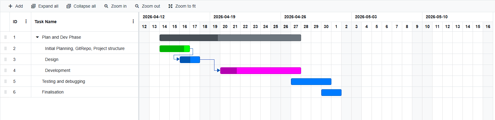

# Year 10 Quiz program - Charlie Gibbs
Year 10 Numeracy revision program with quiz and exam modes, designed to help students practice past exam style questions, receive feedback, and build confidence in mathematics.

## Project Planning

The following Gantt chart outlines the development timeline for the project:

## Updated Gantt chart (1/05/2026)

